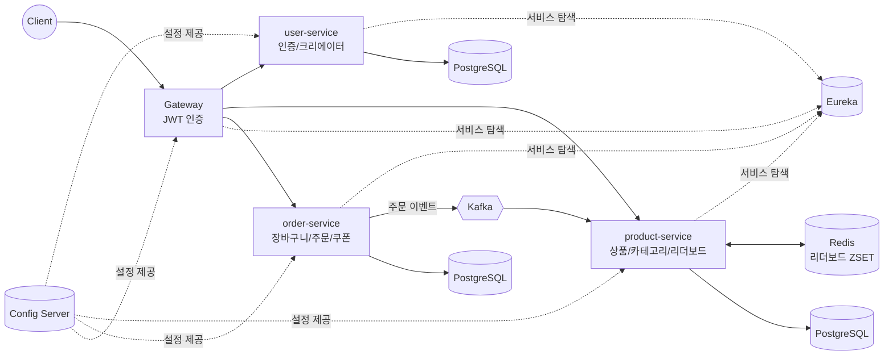

# CC (Creator Culture)

크리에이터가 상품을 등록·판매하고, 카테고리/해시태그 기반 리더보드로 트렌드를 노출하는 크리에이터 커머스 플랫폼입니다. Spring Boot 기반 MSA(멀티모듈)로 구성되어 있습니다.

## 기술 스택

| 구분 | 기술 |
|---|---|
| Language / Runtime | Java 21 |
| Framework | Spring Boot 4.1.1, Spring Cloud 2025.1.2 (Eureka, Config Server, Gateway) |
| 서비스 간 통신 | OpenFeign (동기), Apache Kafka (비동기 이벤트) |
| 인증 | JWT(jjwt), Redis 기반 세션/블랙리스트 |
| 데이터베이스 | PostgreSQL(서비스별 분리), Flyway, Spring Data JPA, QueryDSL |
| 캐시 / 실시간 집계 | Redis (ZSET 기반 리더보드, Lua 스크립트 원자적 연산) |
| 오브젝트 스토리지 | Cloudflare R2 (S3 호환, AWS SDK S3 클라이언트) |
| 관측성 | Prometheus, Grafana, Zipkin(분산 트레이싱), Spring Actuator |
| 테스트 | JUnit5, Testcontainers, EmbeddedKafka, k6(부하테스트) |
| 인프라 / 배포 | Docker Compose(로컬), Terraform(AWS ECS), GitHub Actions(CI/CD) |


## 팀 구성 및 도메인 담당자

> TODO: 실제 팀원 이름/역할로 채워주세요.

| 이름 | 담당 도메인 |
|---|---|
| 김태현 | 카테고리 / 해시태그 / 리더보드 |
| 신동민 | 알림 |
| 안병규 | 장바구니 / 주문 / 인프라 | 
| 안예지 | 인증 / 사용자 / 쿠폰 | 
| 이강석 | 상품 / 리뷰 | 

## 아키텍처

모든 요청은 Gateway를 거쳐 Eureka에 등록된 서비스로 라우팅되고, 서비스 설정은 Config Server가 중앙에서 관리합니다. 서비스 간 동기 호출은 OpenFeign, 비동기 이벤트 전파는 Kafka를 사용합니다.



- **Gateway**: JWT 인증 필터, Redis 기반 세션/블랙리스트 확인 후 각 서비스로 라우팅
- **product-service ↔ order-service**: 주문 결제/취소, 상품 조회수 이벤트를 Kafka로 비동기 전파해 리더보드 점수에 반영
- **category 도메인**: 해시태그 생성/카테고리 승격 이벤트를 Outbox 패턴으로 발행해 DB 트랜잭션과 이벤트 발행 사이 dual-write 문제를 구조적으로 차단


## 모듈 구조

```
cc-service
├── apps
│   ├── user-service      # 인증(JWT), 크리에이터 가입/승인, 팔로우, 알림
│   ├── product-service   # 상품, 카테고리/해시태그, 리더보드, 위시리스트, 리뷰
│   └── order-service     # 장바구니, 주문, 쿠폰
├── infra
│   ├── config-server      # 중앙 설정 관리
│   ├── eureka-server       # 서비스 디스커버리
│   ├── gateway             # API 게이트웨이, JWT 인증 필터
│   └── terraform           # AWS 인프라(ECS, RDS 등) 코드
├── libs
│   └── common              # 공통 응답/예외/Kafka 이벤트 등
└── load-test                # k6 부하 테스트 스크립트
```

각 서비스는 domain / application / infrastructure / presentation 계층으로 구성된 헥사고날 아키텍처 스타일을 따릅니다.

## 로컬 실행 방법

1. `.env.example`을 `.env`로 복사하고 빈 값(DB 비밀번호, JWT_SECRET, R2 키 등)을 채웁니다.
2. 전체 스택 실행:
   ```bash
   docker compose --env-file .env -f compose.yaml -f compose.apps.yaml up -d --build --wait --wait-timeout 240
   ```
3. 접속 확인:

   | 서비스 | 주소 |
      |---|---|
   | Gateway (API 진입점) | http://localhost:8080 |
   | Eureka | http://localhost:8761 |
   | Config Server | http://localhost:8888 |
   | Kafka UI | http://localhost:18080 |
   | Grafana | http://localhost:3000 |
   | Prometheus | http://localhost:9090 |
   | Zipkin | http://localhost:9411 |

개별 서비스(user/product/order-service)는 Gateway를 통해서만 접근하며, 별도 포트로 직접 노출되지 않습니다.

## CI/CD

- **CI**: GitHub Actions가 서비스별로 분리되어 있어(`ci-user-service`, `ci-product-service`, `ci-order-service`, `ci-gateway` 등) 변경된 모듈에 관련된 CI만 실행됩니다.
- **개발 배포(Deploy Development)**: `dev` 브랜치 또는 릴리스 후보를 대상으로 수동 트리거(workflow_dispatch)로 배포하며, 변경된 서비스만 이미지/설정을 다시 빌드·롤링합니다.
- **AWS 배포(AWS Deploy)**: Terraform(ECS) 기반으로 plan/deploy/start/stop/destroy-runtime을 수동으로 선택해 실행합니다.

## 부하테스트

k6 기반 부하 테스트 스크립트가 `load-test/` 아래 서비스/도메인별로 구성되어 있습니다. Docker만 있으면 실행할 수 있고, 실행 결과는 Prometheus/Grafana로 시각화됩니다. 자세한 사용법은 [load-test/README.md](load-test/README.md)를 참고하세요.
